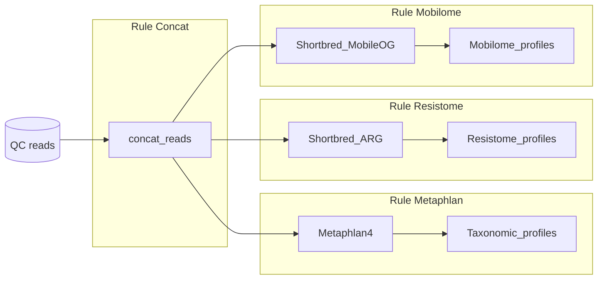

# ARG and Mobilome annotation - read-based pipeline
Read-based pipeline for the annotation of Antibiotic resistance and mobilome genes.


## Installation and requirements
This pipeline requires the use of Snakemake  and usearch v11. 
If not previously installed run the following code: 

```
git clone git@github.com:aponsero/Resistome_ReadBased_Snakemake.git
cd Resistome_ReadBased_Snakemake

## Snakemake installation in a conda environment
conda env create snakemake_env --file envs/env_snakemake.yml

## Installation of usearch v11
mkdir usearch
cd usearch
wget https://drive5.com/downloads/usearch11.0.667_i86linux32.gz
chmod +x usearch11.0.667_i86linux32.gz
gunzip usearch11.0.667_i86linux32.gz
mv usearch11.0.667_i86linux32.gz usearch
```

Additionally, custom shortbred databases should be downloaded.

** Add here Zenodo link to download database **

## Overview of the pipeline

Below is the overview of the steps included in the pipeline. The pipeline requires reads after quality control and trimming.
The pipeline include 3 steps :
* Taxonomic profiling of the microbial community using Metaphlan4 vXX
* ARG profiling using Shortbred vXX against the CARD database vXX
* Mobilome profiling using Shortbred against the MobileOG database vXX



## How to run the pipeline
The pipeline expects the inputs to be provided in the "input" folder as paired files (${SAMPLE_ID}_1.fq.gz and ${SAMPLE_ID}_2.fq.gz) and can be run in its entirety by providing the expected final output : ${SAMPLE_ID}__finallog.txt 

As an example, to run the pipeline on the test file (testpipeline_1.fq.gz and testpipeline_2.fq.gz):

```
# run snakemake
snakemake --cores 8 --use-conda results/testpipeline_finallog.txt
```


